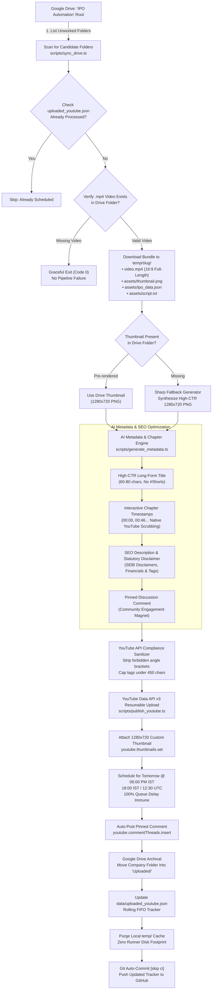
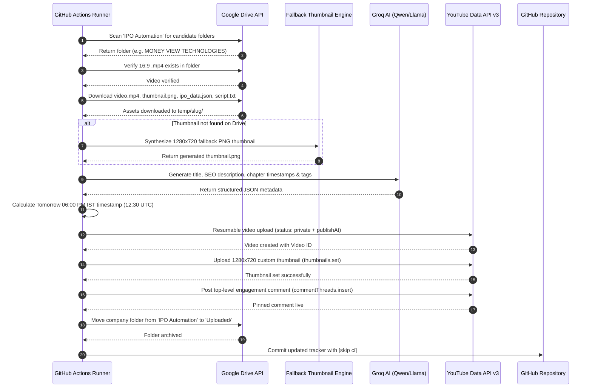

# 📺 Alpha Verdict: Full-Length YouTube Auto-Publisher & SEO Scheduler

[](https://youtube.com)
[](https://developers.google.com/youtube/v3)
[](https://groq.com)
[](https://developers.google.com/drive)
[](https://github.com/features/actions)

An automated cloud microservice that syncs rendered 16:9 full-length IPO deep-dive videos from **Google Drive**, uploads high-CTR **1280×720 custom thumbnails**, generates **clickable interactive chapter timestamps** with **Groq Cloud AI (Qwen 3.8 / Llama 3.3)**, schedules them via **YouTube Data API v3** for **tomorrow at 06:00 PM IST**, auto-posts pinned discussion comments, and archives processed Drive folders.

---

## 🏗️ 1. System Architecture



---

## ⏱️ 2. Execution Sequence Diagram



---

## 💎 3. Key Production Features

### 1. 🖼️ Custom 1280×720 Thumbnail Pipeline
* **Primary Source**: Ingests pre-rendered 1280×720 thumbnails from Google Drive (`assets/thumbnail.png`) rendered by Remotion Still.
* **On-the-Fly Fallback**: If missing, synthesizes a high-contrast 1280×720 PNG using `sharp` within 20 milliseconds, incorporating brand colors, company logo, key financial cards, and analyst verdict badge.
* **Direct YouTube API Upload**: Calls `youtube.thumbnails.set()` immediately after video insertion.

### 2. ⏱️ Interactive Chapter Timestamps
* YouTube automatically converts timestamp notations (`00:00 - Title`) in descriptions into clickable chapters on the video progress bar.
* [generate_metadata.ts](scripts/generate_metadata.ts) extracts `timeline.chapters` from `ipo_data.json` and calculates frame-accurate MM:SS timestamps:
  ```text
  ⏱️ CHAPTER TIMESTAMPS:
  00:00 - Introduction & Issue Overview
  00:46 - Business Model & Revenue Segments
  01:35 - Sector Backdrop & Market TAM
  02:25 - 3-Year Financial Statements & Margins
  03:20 - Issue Split & Fresh Capital Allocation
  04:12 - Listed Peer Benchmarking & Valuation
  05:05 - Critical Red Flags & Structural Risks
  05:58 - Final Analyst Scorecard & Verdict
  ```

### 3. ⏰ Daily 6:00 PM IST Next-Day Scheduling
* Videos created today are scheduled for **Tomorrow at 06:00 PM IST (18:00 IST / 12:30 UTC)**.
* **Queue-Delay Immunity**: Even if GitHub Actions runner experiences peak-hour queue delays, the target publish time is ~24 hours in the future, guaranteeing that YouTube never rejects `publishAt`.
* **7 Videos Weekly Cadence**: Exactly one high-quality full-length video published daily.

### 4. 🛡️ YouTube API Compliance Sanitizer
* YouTube strictly rejects descriptions or tags containing angle brackets (`<` or `>`).
* Automatically replaces arrow notations (`->`, `=>`) with unicode **`➔`**, strips disallowed characters, and enforces the 500-character tag budget.

### 5. 🗂️ Zero-Clutter Google Drive Archival
* Once a video is successfully scheduled, the entire company directory is relocated into an **`Uploaded/`** archive folder via `drive.files.update`. The root folder remains clean.

---

## ⚙️ 4. Setup Guide

### 1. Clone & Install Dependencies
```bash
git clone https://github.com/rajnishkumar13500/yt-schedular-full-length.git
cd yt-schedular-full-length
npm install
```

### 2. Configure Environment (`.env`)
```env
# ─── Google Drive Ingestion (Read Videos & Assets) ─────────────────────────
GDRIVE_REFRESH_TOKEN=your_gdrive_refresh_token
GDRIVE_CLIENT_ID=your_client_id.apps.googleusercontent.com
GDRIVE_CLIENT_SECRET=your_client_secret
GDRIVE_PARENT_FOLDER_ID=your_parent_folder_id

# ─── YouTube Data API v3 (Upload, Thumbnail & Schedule) ────────────────────
YOUTUBE_CLIENT_ID=your_client_id.apps.googleusercontent.com
YOUTUBE_CLIENT_SECRET=your_client_secret
YOUTUBE_REFRESH_TOKEN=your_youtube_refresh_token

# ─── Groq AI Metadata Generation (SEO Titles & Chapters) ───────────────────
GROQ_API_KEY=gsk_your_groq_api_key
GROQ_MODEL=qwen/qwen3.8-27b

# ─── Publication & Scheduling Settings ────────────────────────────────────
YOUTUBE_AUTO_SCHEDULE=true
YOUTUBE_PRIVACY_STATUS=private
YOUTUBE_CATEGORY_ID=27
YOUTUBE_DEFAULT_LANGUAGE=en
```

### 3. One-Click YouTube Authorization
```bash
npm run auth:youtube
```
1. Open the printed authorization link in your browser.
2. Sign in with the Google Account that owns your YouTube channel.
3. The local OAuth server writes `YOUTUBE_REFRESH_TOKEN` directly to `.env`.

### 4. Test Connection
```bash
npm run test:youtube
```

### 5. Run Non-Destructive Audit & Dry Run
```bash
npm run verify
```
Scans Drive, downloads assets, synthesizes thumbnail, runs AI metadata & timestamp generation, and tests all compliance rules without publishing.

---

## 🛠️ 5. CLI Commands Reference

| Command | Action |
| :--- | :--- |
| `npm run auth:youtube` | Launches local OAuth server for 1-click YouTube channel authorization |
| `npm run test:youtube` | Tests connection with YouTube API and verifies channel metadata |
| `npm run sync:drive` | Scans Google Drive for unworked folders and verifies `.mp4` video presence |
| `npm run verify` | Performs a complete non-destructive dry-run audit of metadata & compliance |
| `npm run publish` | Executes live end-to-end publishing, thumbnail setting, commenting, and Drive archival |

---

## 🤖 6. GitHub Actions Cloud Automation

The automated workflow in [`.github/workflows/youtube_publisher.yml`](.github/workflows/youtube_publisher.yml) runs **daily at 06:00 PM IST** (7 days/week):

* **Schedule Trigger**: `12:30 UTC` (**06:00 PM IST**) ➔ Schedules for **Tomorrow 06:00 PM IST**
* **Manual Dispatch**: Triggerable anytime with optional privacy overrides.

### Required GitHub Repository Secrets
Under **Settings ➔ Secrets and variables ➔ Actions**, configure:
1. `YOUTUBE_REFRESH_TOKEN`
2. `YOUTUBE_CLIENT_ID`
3. `YOUTUBE_CLIENT_SECRET`
4. `GDRIVE_REFRESH_TOKEN`
5. `GDRIVE_CLIENT_ID`
6. `GDRIVE_CLIENT_SECRET`
7. `GDRIVE_PARENT_FOLDER_ID`
8. `GROQ_API_KEY`