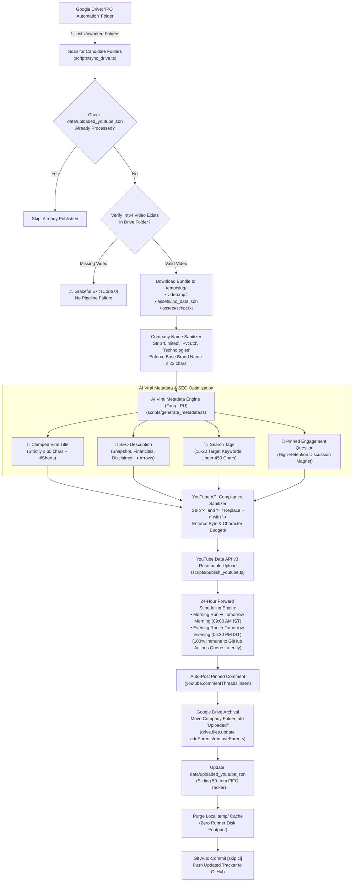
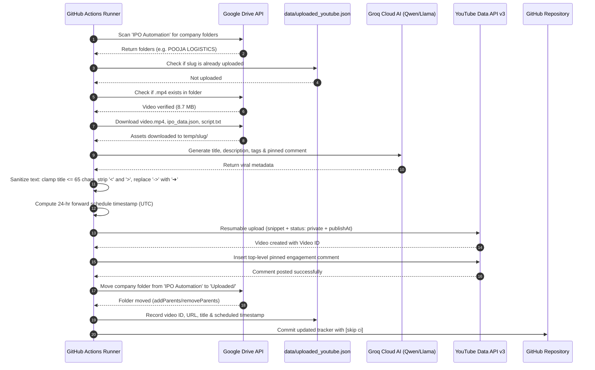

# 📺 Alpha Verdict: YouTube Auto-Publisher & Viral SEO Scheduler

[](https://youtube.com)
[](https://developers.google.com/youtube/v3)
[](https://groq.com)
[](https://developers.google.com/drive)
[-brightgreen?logo=githubactions)](https://github.com/features/actions)

An automated cloud microservice that syncs rendered IPO vertical videos from **Google Drive**, validates asset integrity, generates high-retention viral YouTube Shorts metadata using **Groq Cloud (Qwen 3.8 / Llama 3.3)**, schedules them via **YouTube Data API v3** with a **24-hour forward buffer**, auto-posts pinned engagement comments, and archives processed Drive folders.

---

## 🏗️ 1. System Architecture



---

## ⏱️ 2. Execution Sequence Diagram



---

## 💎 3. Key Production Features

### 1. 🛡️ Strict Title Length Clamping & Name Sanitization
* **Problem**: YouTube allows up to 100 characters in titles, but mobile YouTube Shorts feeds truncate any title over **60–65 characters** with an ellipsis (`...`), hiding the hook and `#Shorts` tag.
* **Solution**:
  * Strips corporate legal noise words (`Private Limited`, `Pvt Ltd`, `Limited`, `Technologies`, `Industries`, `Holdings`, `India`, etc.).
  * Formula: `[Short Brand] IPO: [Hook] 🚨 #Shorts`
  * Strict code-level double-lock clamps titles $\le 65$ characters.

### 2. ⏰ 24-Hour Forward Scheduling Buffer (Queue Delay Immunity)
* **Problem**: GitHub Actions runners can experience cloud queue delays (5–30 minutes). Scheduling a video for "soon" risks past-timestamp rejection (`publishAt must be in the future`).
* **Solution**:
  * **Morning Run (~09:30 AM IST)**: Schedules for **Tomorrow Morning at 09:00 AM IST** (~23.5 hours ahead).
  * **Evening Run (~07:30 PM IST)**: Schedules for **Tomorrow Evening at 06:30 PM IST** (~23.0 hours ahead).
  * 100% immune to runner latency + gives YouTube 24 hours to process high-definition VP9/AV1 codecs and optimize Shorts shelf distribution.

### 3. 🗂️ Google Drive Archival (`Uploaded/`)
* Once a video is successfully scheduled on YouTube, the entire company directory (video + `ipo_data.json` + `script.txt`) is moved into an **`Uploaded/`** folder via `drive.files.update`. The root folder remains pristine and uncluttered.

### 4. 🔍 Graceful Video Existence Check
* If a company folder is missing an `.mp4` file, the publisher logs a clear warning and exits gracefully with code `0`, avoiding false alarm failures in GitHub Actions.

### 5. 🛡️ YouTube API Character Sanitizer
* YouTube Data API v3 strictly rejects descriptions and tags containing `<` or `>`. The sanitizer automatically replaces arrow notations (`->`, `=>`) with unicode **`➔`**, cleans stray brackets, and enforces the 500-character tag budget.

---

## 🎨 4. Channel Identity & Official Assets

* **Channel Name**: **Alpha Verdict**
* **Handle**: `@AlphaVerdict`
* **Official Branding Files**:
  * **Banner (2560×1440 px)**: [`assets/branding/alpha_verdict_banner_2560x1440.jpg`](assets/branding/alpha_verdict_banner_2560x1440.jpg)
  * **Profile Icon (800×800 px)**: [`assets/branding/alpha_verdict_icon_800x800.jpg`](assets/branding/alpha_verdict_icon_800x800.jpg)

---

## ⚙️ 5. Setup Guide

### 1. Clone & Install Dependencies
```bash
git clone https://github.com/rajnishkumar13500/ipo-youtube-publisher.git
cd ipo-youtube-publisher
npm install
```

### 2. Configure Local Environment (`.env`)
```env
# ─── Google Drive Ingestion (Read Videos & Assets) ─────────────────────────
GDRIVE_REFRESH_TOKEN=your_gdrive_refresh_token
GDRIVE_CLIENT_ID=your_client_id.apps.googleusercontent.com
GDRIVE_CLIENT_SECRET=your_client_secret
GDRIVE_PARENT_FOLDER_ID=your_parent_folder_id

# ─── YouTube Data API v3 (Upload & Schedule Videos) ────────────────────────
YOUTUBE_CLIENT_ID=your_client_id.apps.googleusercontent.com
YOUTUBE_CLIENT_SECRET=your_client_secret
YOUTUBE_REFRESH_TOKEN=your_youtube_refresh_token

# ─── Groq AI Metadata Generation (Viral Titles & Descriptions) ─────────────
GROQ_API_KEY=gsk_your_groq_api_key
GROQ_MODEL=qwen/qwen3.8-27b

# ─── Publication & Scheduling Settings ────────────────────────────────────
YOUTUBE_AUTO_SCHEDULE=true
YOUTUBE_PRIVACY_STATUS=private
YOUTUBE_CATEGORY_ID=27
YOUTUBE_DEFAULT_LANGUAGE=en
```

### 3. One-Click YouTube Authorization
```bash
npm run auth:youtube
```
1. Open the printed authorization link in your browser.
2. Sign in with the Google Account that owns **Alpha Verdict**.
3. The local server automatically captures your `YOUTUBE_REFRESH_TOKEN` and writes it to `.env`!

### 4. Verify Connection
```bash
npm run test:youtube
```
Confirms channel title, subscriber count, and upload capabilities.

### 5. Run Audit & Dry-Run (Non-Destructive)
```bash
npm run verify
```
Inspects candidate folders on Google Drive, runs AI metadata generation, checks 9 compliance rules, and displays the exact output preview without publishing.

---

## 🛠️ 6. CLI Commands Reference

| Command | Action |
| :--- | :--- |
| `npm run auth:youtube` | Launches local OAuth server for 1-click YouTube channel authorization |
| `npm run test:youtube` | Tests connection with YouTube API and verifies channel metadata |
| `npm run sync:drive` | Scans Google Drive for unworked folders and verifies `.mp4` video presence |
| `npm run verify` | Performs a complete non-destructive dry-run audit of metadata & compliance |
| `npm run publish` | Executes live end-to-end publishing, scheduling, commenting, and Drive archival |

---

## 🤖 7. GitHub Actions Cloud Automation

The publisher workflow in [`.github/workflows/youtube_publisher.yml`](.github/workflows/youtube_publisher.yml) runs **twice daily, 7 days a week**:

* **Morning Run**: `04:00 UTC` (**09:30 AM IST**) ➔ Schedules for **Tomorrow 09:00 AM IST**
* **Evening Run**: `14:00 UTC` (**07:30 PM IST**) ➔ Schedules for **Tomorrow 06:30 PM IST**
* **Manual Dispatch**: Triggerable anytime with optional privacy overrides.

### Required GitHub Repository Secrets
Under **Settings ➔ Secrets and variables ➔ Actions**, configure:
1. `YOUTUBE_REFRESH_TOKEN`
2. `YOUTUBE_CLIENT_ID`
3. `YOUTUBE_CLIENT_SECRET`
4. `GDRIVE_REFRESH_TOKEN`
5. `GDRIVE_CLIENT_ID`
6. `GDRIVE_CLIENT_SECRET`
7. `GDRIVE_PARENT_FOLDER_ID`
8. `GROQ_API_KEY`
