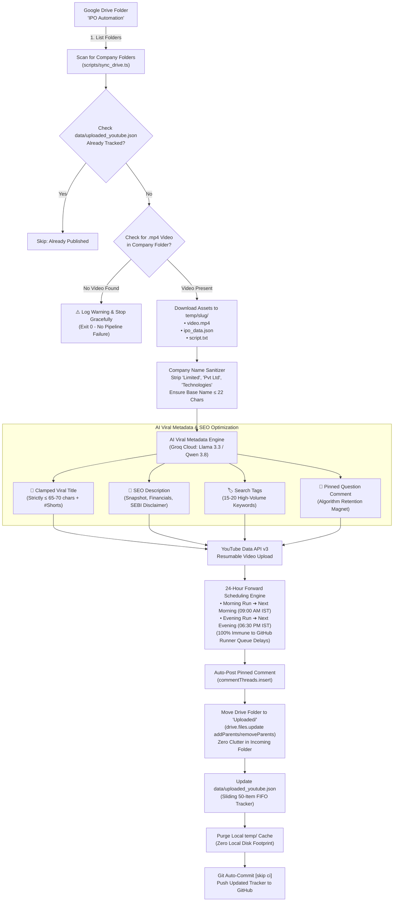

# 🎬 IPO YouTube Auto-Publisher: Updated End-to-End Architectural Flow

This document details the refined, production-grade lifecycle of how finished IPO videos stored on **Google Drive** are discovered, validated, enhanced with **viral AI metadata (Groq Qwen/Llama)**, scheduled via **YouTube Data API v3** with a **24-hour forward buffer**, and archived into a dedicated **`Uploaded/`** Drive folder.

---

## 1. Updated Architectural Flowchart



---

## 2. Key Enhancements & Refinements

### 1. 🛡️ Strict Title Length Clamping & Name Sanitization
- **Problem**: YouTube allows up to 100 characters in titles, but mobile YouTube Shorts feeds truncate any title longer than **60–70 characters** with an ugly ellipsis (`...`), hiding the hook and `#Shorts` tag. Furthermore, many Indian companies have huge legal names like *"Northern Arc Capital Limited"* or *"Diffusion Engineers Limited"*.
- **Solution**:
  1. **Legal Suffix Sanitizer**: Automatically strips corporate legal suffixes before sending to Groq or formatting titles:
     - Strips: `Private Limited`, `Pvt Ltd`, `Pvt. Ltd.`, `Limited`, `Ltd`, `Technologies`, `Industries`, `Holdings`, `India`, `Corporation`.
     - *Example*: `"Kalyan Jewellers India Limited"` ➔ `"Kalyan Jewellers"`
     - *Example*: `"Pooja Logistics Limited"` ➔ `"Pooja Logistics"`
  2. **Strict Character Budget**:
     ```
     [Brand Name: 15-22 chars] + " IPO: " [6 chars] + [Hook: 18-22 chars] + " 🚨 #Shorts" [10 chars]
     Total: ~55 - 63 characters (Always < 65 chars!)
     ```
  3. **Double-Lock Truncation Safeguard**:
     - **Prompt Layer**: Instructs Groq to keep title strictly under 60 characters.
     - **Code Layer**: If Groq returns a title > 68 characters, code automatically clamps and reconstructs:
       `${sanitizedName} IPO: Apply or Avoid? 🚨 #Shorts` (Guaranteed safety).

---

### 2. 🗂️ Google Drive Folder Archival (`Uploaded/`)
- **Problem**: Leaving completed folders in the root `IPO Automation` directory creates confusion, clutters Drive, and relies entirely on local JSON tracking.
- **Solution**:
  - Once a video is successfully uploaded and scheduled on YouTube:
    1. The publisher checks for (or creates) an **`Uploaded`** folder inside the Google Drive root.
    2. Moves the **entire company folder and 100% of all its contents** (all videos, assets, audio, scripts, images, and data files) from `IPO Automation` into `Uploaded/` by updating the parent of `folderId`:
       ```typescript
       await drive.files.update({
         fileId: folderId,
         addParents: uploadedFolderId,
         removeParents: parentFolderId,
         fields: 'id, parents'
       });
       ```
    3. The incoming folder stays completely clean, containing only active/pending videos.

---

### 3. 🔍 Graceful Video Existence Verification
- **Problem**: If an automated render failed or a folder was partially created with no `.mp4` video, the publisher should not crash or trigger GitHub Actions red alerts.
- **Solution**:
  - When scanning an unprocessed folder, the script verifies that a valid `.mp4` file is present.
  - If no `.mp4` is found:
    - Logs: `⚠️ [Skip] No .mp4 video found in folder "${folder.name}". Stopping gracefully.`
    - Exits gracefully with code `0`. No false error alarms on GitHub Actions.

---

### 4. ⏰ 24-Hour Forward Scheduling Buffer (Queue Delay Immunity)
- **Problem**:
  - GitHub Actions runners run on public cloud VMs that often experience queue delays (5 to 30 minutes during peak hours).
  - If a video is scheduled for "15 minutes from now", a GitHub queue delay means the job might execute *after* the scheduled time, causing YouTube API to throw a fatal error: `publishAt timestamp must be in the future`.
- **Solution**:
  - **24-Hour Forward Window**:
    - **Morning Execution** (e.g. 09:30 AM IST): Schedules the video for the **Next Day's Morning slot** (e.g. tomorrow at 09:00 AM IST ~23.5 hours ahead).
    - **Evening Execution** (e.g. 07:30 PM IST): Schedules the video for the **Next Day's Evening slot** (e.g. tomorrow at 06:30 PM IST ~23 hours ahead).
  - **Benefits**:
    1. **100% Queue Delay Immune**: Even if GitHub Actions runner is queued for 1 hour, the schedule timestamp is still ~22-23 hours in the future. It will **never** fail.
    2. **Algorithm Advantage**: YouTube servers have 24 hours to process high-definition video, generate AV1/VP9 codecs, transcribe automated audio captions, and prepare optimal Shorts shelf indexing before it goes public.
    3. **Paced Cadence**: Guarantees a steady rhythm of 2 videos published per day (1 morning, 1 evening).

---

### 5. 🏷️ Rich SEO Keywords & Tags + JSON Tracker
- **Search Tags (Up to 500 characters)**:
  - High-intent keyword formula combining:
    - **Core Brand**: `[brand]`, `[brand] ipo`, `[brand] limited ipo`
    - **Action Intent**: `[brand] ipo apply or avoid`, `[brand] ipo review`, `[brand] ipo gmp today`
    - **Market Queries**: `upcoming ipos 2026`, `latest ipo review`, `stock market india`, `share market shorts`
    - **Allotment & Dates**: `[brand] ipo allotment status`, `[brand] ipo listing date`
- **Sliding FIFO Tracking (`data/uploaded_youtube.json`)**:
  - Maintains rolling 50 uploads with Video ID, YouTube URL, Scheduled Time, Title, and Date.
  - Automatically committed and pushed to GitHub with `[skip ci]`.

---

## 3. GitHub Actions Twice-Daily Schedule

The workflow runs **twice daily, 7 days a week** (14 runs/week) plus manual trigger:

| Run Window | UTC Cron | IST Time | Action Taken |
| :--- | :--- | :--- | :--- |
| **Morning Run** | `0 4 * * *` | **09:30 AM IST** | Ingests morning video ➔ Schedules for **Tomorrow 09:00 AM IST** ➔ Archives to `Uploaded/` |
| **Evening Run** | `0 14 * * *` | **07:30 PM IST** | Ingests evening video ➔ Schedules for **Tomorrow 06:30 PM IST** ➔ Archives to `Uploaded/` |
| **Manual Trigger** | `workflow_dispatch` | On Demand | Instantly schedules next available video with 24-hr buffer |

---

## 4. Next Implementation Steps

1. **Update `scripts/sync_drive.ts`**:
   - Add `moveFolderToArchive(folderId, currentParentId)` to relocate completed folders to `Uploaded/`.
   - Add video existence verification before initiating download.
2. **Update `scripts/generate_metadata.ts`**:
   - Implement `cleanCompanyName()` helper to strip legal suffixes (`Limited`, `Pvt Ltd`, etc.).
   - Enforce hard clamp on `title.length <= 68` with fallback truncation.
3. **Update `scripts/publish_youtube.ts`**:
   - Implement `calculate24HourScheduleTime()` matching the morning ➔ next morning, evening ➔ next evening logic.
4. **Update `scripts/pipeline.ts`**:
   - Wire the graceful exit when no video is found.
   - Execute the folder move to `Uploaded/` upon successful upload.
5. **Update `.github/workflows/youtube_publisher.yml`**:
   - Ensure `YOUTUBE_AUTO_SCHEDULE=true` is enabled by default in GitHub Actions.
