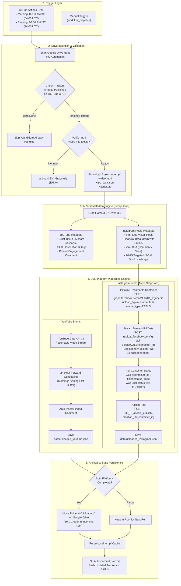
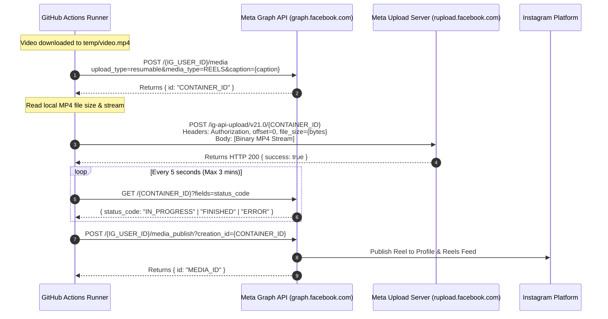

# 📸 Meta Instagram Reels Auto-Publisher Plan (GitHub Actions)

This document outlines the complete architectural design, execution flow, Meta Graph API integration, and GitHub Actions automation plan to publish IPO videos as **Instagram Reels** alongside YouTube Shorts directly from **Google Drive**.

---

## 1. End-to-End Architectural Flowchart



---

## 2. Why Meta Graph API Resumable Upload is Perfect for GitHub Actions

Traditional Instagram automation typically suffers from two issues:
1. **Third-party hosting requirement**: Standard API usually requires a public AWS S3 URL.
2. **Account ban risk**: Unofficial mobile APIs (Puppeteer / Private APIs) get blocked immediately on datacenter IPs like GitHub Actions.

### The Solution: Meta Direct Resumable Upload (`rupload.facebook.com`)
Meta's official Instagram Graph API includes a **resumable binary upload endpoint**. This allows GitHub Actions to stream the local `video.mp4` directly to Meta's servers with **zero third-party hosting**, **zero cloud storage costs**, and **100% official safety**.

---

## 3. Detailed 3-Step Instagram Reels API Protocol



### Protocol Breakdown:
1. **Phase 1: Create Container**
   - Endpoint: `POST https://graph.facebook.com/v21.0/${INSTAGRAM_ACCOUNT_ID}/media`
   - Parameters:
     - `upload_type`: `"resumable"`
     - `media_type`: `"REELS"`
     - `caption`: AI-generated caption with hook, snapshot, disclaimer & hashtags
     - `share_to_feed`: `true` (Shares to both Reels tab and main profile grid)
     - `access_token`: Permanent Page Access Token

2. **Phase 2: Stream Binary Video**
   - Endpoint: `POST https://rupload.facebook.com/ig-api-upload/v21.0/${containerId}`
   - Headers:
     - `Authorization: OAuth ${INSTAGRAM_ACCESS_TOKEN}`
     - `file_size: ${fileSizeBytes}`
     - `offset: 0`
   - Body: Raw read-stream of the local `.mp4` file.

3. **Phase 3: Wait & Publish**
   - Polling: Queries `status_code` every 5 seconds until it transitions from `IN_PROGRESS` to `FINISHED`.
   - Publish: Calls `POST https://graph.facebook.com/v21.0/${INSTAGRAM_ACCOUNT_ID}/media_publish` with `creation_id`.

---

## 4. AI Viral Caption Strategy for Instagram Reels

Unlike YouTube Shorts (which relies on title keywords), Instagram Reels algorithm indexes the **caption** for Explore and search ranking.

### Reel Caption Architecture:
```text
🚨 [Brand Name] IPO: Apply or Avoid? Honest Review! 👇
────────────────────────────────────────
Should you invest in [Brand Name] IPO? Here is the complete breakdown in 60 seconds!

📊 Key IPO Highlights:
• Issue Size: ₹[Amount] Cr
• Price Band: ₹[Range]
• Lot Size: [Shares] shares (Min Investment: ₹[Amount])

📈 Financial Health:
• Revenue Growth: ₹[X] Cr ➔ ₹[Y] Cr
• Net Profit (PAT): ₹[Z] Cr

💡 Analyst Verdict:
[Apply with caution / Avoid / High risk - short 1 sentence summary]

💬 Will you apply for this IPO or skip? Comment 'APPLY' or 'SKIP' below! 👇
🔖 Save this reel to check listing day gains!

⚠️ Disclaimer: For educational purposes only. Not investment or financial advice. Consult a SEBI registered advisor before investing.

.
.
#IPO #IPOAlert #[Brand]IPO #StockMarketIndia #ShareMarket #Nifty50 #Sensex #Investment #StockMarketNews #Trading #IndianStockMarket #FinanceTips #ReelsIndia #ReelsViral
```

---

## 5. State Management & Tracker Isolation

To ensure that a temporary glitch on one platform does not block the other, we maintain independent trackers:

```text
data/
├── uploaded_youtube.json     <-- Tracks YouTube Video IDs, Titles, and Published URLs
└── uploaded_instagram.json   <-- Tracks Instagram Media IDs, Permalinks, and Post Timestamps
```

### Safety Logic:
- If a video is published to YouTube but Instagram fails:
  - YouTube tracker saves the upload.
  - The folder on Google Drive is **NOT** moved to `Uploaded/` yet.
  - On the next run, the pipeline detects that YouTube is already done, skips YouTube, and only attempts the pending Instagram upload.
- Once **both** trackers confirm completion, the Drive folder is archived to `Uploaded/`.

---

## 6. One-Time Meta Developer Account Setup

To enable GitHub Actions to post on your behalf, complete these one-time steps:

### Step 1: Switch Instagram to Professional
1. Open Instagram on your phone: `Settings` ➔ `Account type and tools` ➔ `Switch to Professional Account` (Choose **Creator** or **Business**).
2. Connect your Instagram account to a **Facebook Page** (Settings ➔ Linked Accounts ➔ Facebook Page). Create a blank page if you do not have one.

### Step 2: Create a Meta Developer App
1. Visit [developers.facebook.com](https://developers.facebook.com/) and log in with your Facebook account.
2. Click **My Apps** ➔ **Create App** ➔ Select **Other** ➔ Select **Business**.
3. Under Add Products, add **Instagram Graph API**.

### Step 3: Generate Never-Expiring System User Token
1. In Meta Business Suite (`business.facebook.com`):
   - Go to **Business Settings** ➔ **System Users** ➔ Click **Add**.
   - Role: **Admin**.
2. Click **Generate Token**:
   - Select your App.
   - Token Expiration: **Never**.
   - Check Permissions:
     - `instagram_basic`
     - `instagram_content_publish`
     - `pages_show_list`
     - `pages_read_engagement`
3. Copy the generated token (`INSTAGRAM_ACCESS_TOKEN`).

### Step 4: Get your Instagram Business Account ID
Run a quick query via Graph API Explorer or curl:
```bash
https://graph.facebook.com/v21.0/me/accounts?access_token=YOUR_TOKEN
```
It returns your Page ID and connected Instagram Account ID (`INSTAGRAM_ACCOUNT_ID`).

---

## 7. GitHub Actions Workflow Configuration

Update the existing `.github/workflows/youtube_publisher.yml` (or rename to `publisher.yml`) to support both platforms seamlessly:

```yaml
name: Scheduled IPO Multi-Platform Publisher (YouTube & Instagram)

on:
  schedule:
    # 09:30 AM IST (04:00 UTC) & 07:30 PM IST (14:00 UTC) Every Day
    - cron: '0 4 * * *'
    - cron: '0 14 * * *'
  workflow_dispatch:
    inputs:
      publish_youtube:
        description: 'Publish to YouTube (true/false)'
        required: false
        default: 'true'
      publish_instagram:
        description: 'Publish to Instagram Reels (true/false)'
        required: false
        default: 'true'

permissions:
  contents: write

concurrency:
  group: multi-platform-publisher
  cancel-in-progress: false

jobs:
  publish-videos:
    name: Sync Drive, Generate SEO & Publish
    runs-on: ubuntu-latest
    timeout-minutes: 25

    steps:
      - name: Checkout Code
        uses: actions/checkout@v4
        with:
          token: ${{ secrets.GITHUB_TOKEN }}
          fetch-depth: 1

      - name: Setup Node.js
        uses: actions/setup-node@v4
        with:
          node-version: 20
          cache: 'npm'

      - name: Install NPM Dependencies
        run: npm ci

      - name: Run Multi-Platform Auto-Publisher Pipeline
        env:
          # Google Drive Ingestion
          GDRIVE_REFRESH_TOKEN: ${{ secrets.GDRIVE_REFRESH_TOKEN }}
          GDRIVE_CLIENT_ID: ${{ secrets.GDRIVE_CLIENT_ID }}
          GDRIVE_CLIENT_SECRET: ${{ secrets.GDRIVE_CLIENT_SECRET }}
          GDRIVE_PARENT_FOLDER_ID: ${{ secrets.GDRIVE_PARENT_FOLDER_ID }}

          # YouTube Data API
          YOUTUBE_CLIENT_ID: ${{ secrets.YOUTUBE_CLIENT_ID }}
          YOUTUBE_CLIENT_SECRET: ${{ secrets.YOUTUBE_CLIENT_SECRET }}
          YOUTUBE_REFRESH_TOKEN: ${{ secrets.YOUTUBE_REFRESH_TOKEN }}
          YOUTUBE_AUTO_SCHEDULE: 'true'

          # Instagram Graph API
          INSTAGRAM_ACCOUNT_ID: ${{ secrets.INSTAGRAM_ACCOUNT_ID }}
          INSTAGRAM_ACCESS_TOKEN: ${{ secrets.INSTAGRAM_ACCESS_TOKEN }}
          ENABLE_INSTAGRAM: ${{ github.event.inputs.publish_instagram || 'true' }}
          ENABLE_YOUTUBE: ${{ github.event.inputs.publish_youtube || 'true' }}

          # AI Metadata Engine (Groq)
          GROQ_API_KEY: ${{ secrets.GROQ_API_KEY }}
          GROQ_MODEL: ${{ vars.GROQ_MODEL || 'qwen/qwen3.8-27b' }}
        run: npm run publish

      - name: Commit & Push Updated Trackers
        run: |
          git config --global user.name "github-actions[bot]"
          git config --global user.email "github-actions[bot]@users.noreply.github.com"
          git add data/uploaded_youtube.json data/uploaded_instagram.json
          if git diff --staged --quiet; then
            echo "✨ Trackers are up-to-date. No commit needed."
          else
            git commit -m "chore: update YouTube and Instagram upload trackers [skip ci]"
            git pull --rebase origin main
            git push origin main
            echo "✅ Trackers committed and pushed to main."
          fi
```

---

## 8. Implementation Checklist

- [ ] **Create `scripts/publish_instagram.ts`**:
  - Implements container creation, binary streaming to `rupload.facebook.com`, status polling, and publication.
- [ ] **Add `generateInstagramCaption` in `scripts/generate_metadata.ts`**:
  - Groq AI prompt tuned specifically for Instagram Reels (emojis, formatting, line breaks, 20-25 targeted hashtags, engagement callout).
- [ ] **Add `data/uploaded_instagram.json` tracker logic in `scripts/tracker.ts`**:
  - `isIPOAlreadyOnInstagram()` and `recordInstagramUpload()`.
- [ ] **Update `scripts/pipeline.ts`**:
  - Add parallel/sequential publishing to YouTube and Instagram.
  - Archive Google Drive folder only when both target platforms succeed.
- [ ] **Create `scripts/test_instagram.ts`**:
  - Quick sanity script to verify token validity, fetch Instagram profile details, and test container readiness before running the full pipeline.
- [ ] **Add GitHub Secrets**:
  - `INSTAGRAM_ACCOUNT_ID`
  - `INSTAGRAM_ACCESS_TOKEN`
